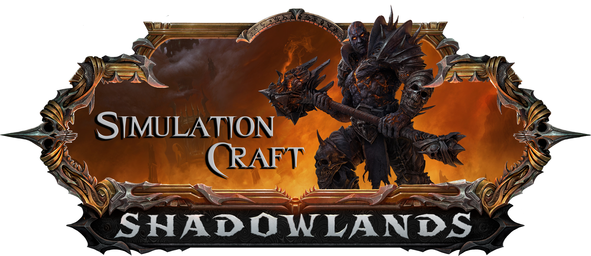
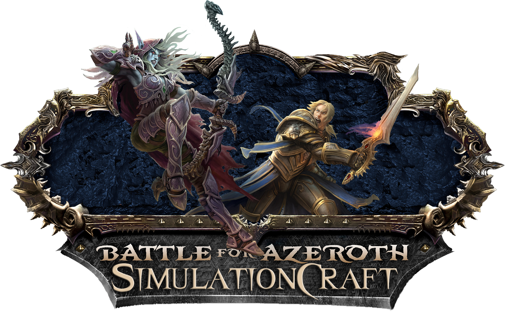
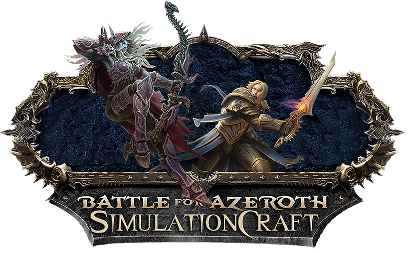
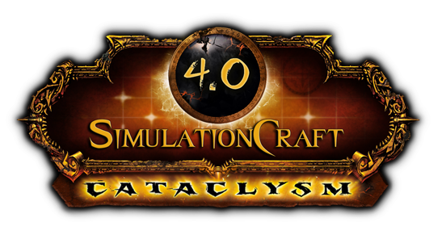
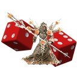
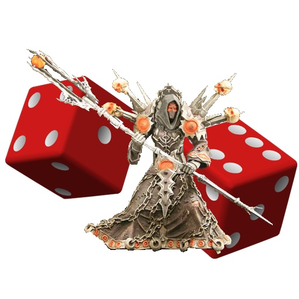
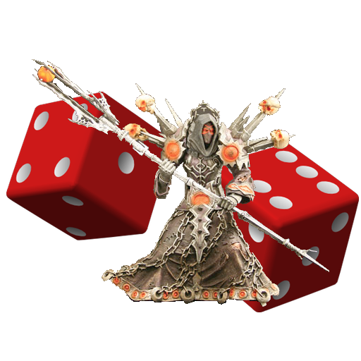

# Collection of SimulationCraft logos throughout World of Warcraft expansions.

All modern logos are created by graphics designer Julianne Albert (enchant@silkenfire.com). 

## The War Within

Small:

Medium:

Big:

## Dragonflight

Small:

Medium:

Big:

## Shadowlands

Full resolution:

HTML resolution:

Extra small resolution:

## Battle for Azeroth

Full resolution:

HTML resolution:

## Legion

## Warlords of Draenor

## Mists of Pandaria

## Cataclysm

## Classical SimC Logos
These images were created by Craig Hughes for the project, primarily for use as application icons. There's a "small" image and a "larger" one. Small is just a die, large is a pair of dice with a warlock standing in front of them.

Images are available in PNG (transparent white bground) or JPG (smaller byte size, but no transparency):

